## About

Alex, is an Assistant Professor of Research in Systems and Computational Biomedicine and an Assistant Professor of Research in Computational Biomedicine at Weill Cornell Medicine, the Director of AI-XR Lab, and the Director of AI and XR at the Englander Institute for Precision Medicine at Weil Cornell Medicine.

He develops software solutions for the Englander Institute for Precision Medicine and Institute for Computational Biomedicine with projects spanning over healthcare system design, LIMS, and pipeline design for computational genomic analysis. His research interest focus is on leveraging AI and Medical Extended Reality technologies in a translational manner benefiting patients but also towards teaching the future of medicine in a plethora of medical domains including Precision Medicine, Emergency Medicine, Embryology, Otorhinolaryngology, Cardiology, Pathology, Radiology and Medical Education.

A Fulbright scholar recipient, Alex earned his master's in Computer Science from Columbia University. While at Columbia, Alex worked as a researcher at Prof. Allen’s Robotics Lab focusing on medical robotics for surgery and brain-computer interfaces.

### 🔗 Links

