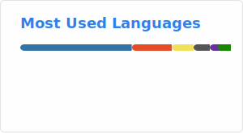

## About

Alexandros Sigaras is an Assistant Professor of Research in Systems and Computational Biomedicine at Weill Cornell Medicine, where he directs the AI-XR Lab and serves as Director of Artificial Intelligence and Extended Reality at the Englander Institute for Precision Medicine.

His research focuses on the development of secure, scalable, and AI-driven computing solutions, deployed primarily in the cloud, that transform complex, multimodal medical data into actionable clinical and scientific insight, with applications spanning precision medicine and broader areas of medicine. This work encompasses healthcare system design, laboratory information management systems (LIMS), and the design of computational pipelines for large-scale genomic analysis in cancer care, together with multimodal AI that integrates genomic, imaging, and bioacoustic data. As Co-Investigator and Module Lead on the National Institutes of Health (NIH) Bridge2AI: Voice as a Biomarker of Health consortium, he contributes to the development of ethically sourced voice datasets and foundation models that employ the human voice as a biomarker of health.

In a complementary line of inquiry, Sigaras leads research on extended reality (XR) and spatial computing in medicine, ranging from the immersive visualization of genomic and healthcare data for remote collaboration to AI-powered virtual humans and conversational agents for clinical training and education. By uniting generative AI, large language models, and mixed, virtual, and augmented reality, he seeks to apply these technologies in a translational manner that benefits patients while advancing the education of future clinicians across numerous medical domains, including precision medicine, emergency medicine, embryology, otorhinolaryngology, cardiology, pathology, radiology, and medical education.

A Fulbright Scholar, Sigaras earned his Master of Science in Computer Science from Columbia University, where he conducted research in Professor Peter Allen's Robotics Laboratory on medical robotics for surgery and on brain-computer interfaces.
As an undergraduate, he delivered numerous invited talks on his research at universities and academic conferences, presenting to audiences that included the Prime Minister of Greece and the Chairman of Microsoft, Bill Gates. In parallel with his studies, he worked within Microsoft's education division, where he supported universities in their transition to cloud computing, and served as a technical editor for a computer magazine.

### 🔗 Links

<h3>
  <picture>
    <source media="(prefers-color-scheme: dark)" srcset="https://github.githubassets.com/images/modules/logos_page/GitHub-Mark-Light-64px.png">
    <source media="(prefers-color-scheme: light)" srcset="https://github.githubassets.com/assets/GitHub-Mark-ea2971cee799.png">
    
  </picture>
  GitHub Stats
</h3>

